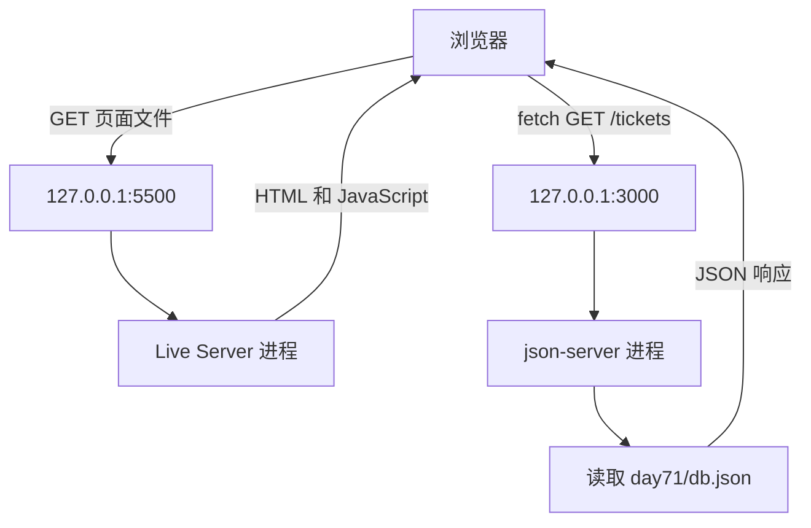

# Day72：程序、进程、端口和服务器

## 今天为什么学这些

Day71 的前端已经能够通过 API 读取、创建、修改和删除工单。进入 Python Web 后端以前，需要先弄清楚：代码文件为什么要“运行”以后才能响应请求，`5500`、`3000` 和 `8000` 又分别代表什么。

今天不安装 FastAPI，也不编写业务路由。先通过真实的启动、访问和关闭实验，理解服务器最基本的运行方式。

## 当前工单系统的两条线路



- `5500` 的 Live Server 提供 HTML 和 JavaScript 等前端文件。
- `3000` 的 json-server 提供工单 API。
- 两个服务都运行在本机，但它们是两个独立进程，所以使用不同端口。
- 关闭其中一个服务，只会中断经过该服务的新请求，不会让另一个服务自动停止。
- 浏览器已经得到的数组和 DOM 可能暂时保留；再次请求时才会发现服务已经停止。

## 核心概念

| 概念 | 当前项目中的含义 |
|---|---|
| 文件 | 硬盘上的 `index.html`、`main.js`、`db.json` 等内容 |
| 程序 | 可以被执行的代码，例如 Chrome、Node.js、Python、json-server |
| 进程 | 程序运行后，由操作系统管理的一个运行实例；每次启动会得到一个 PID |
| 服务器进程 | 持续运行、监听端口、接收请求并返回响应的进程 |
| `127.0.0.1` | 当前这台电脑的本地回环地址 |
| 端口 | 操作系统用来把网络请求交给具体进程的编号 |
| 路径 | 交给服务器进一步处理的资源位置，例如 `/tickets` 或 `/index.html` |

## URL 的组成

以下地址：

```text
http://127.0.0.1:3000/tickets
```

可以拆成：

| 部分 | 含义 |
|---|---|
| `http` | 浏览器和服务器使用的通信协议 |
| `127.0.0.1` | 请求当前这台电脑 |
| `3000` | 把请求交给监听 3000 的服务器进程 |
| `/tickets` | 请求该服务器中的工单资源 |

端口只决定请求交给哪个进程，不决定服务器返回什么内容。返回内容还取决于服务器程序和它的网站根目录或业务路由。

## 实验一：观察 json-server 进程

在仓库根目录启动：

```powershell
npx.cmd json-server@0.17.4 --watch day71/db.json --port 3000
```

这里使用 `npx.cmd`，是因为当前 PowerShell 执行策略会阻止 `npx.ps1`。

在另一个终端查看监听状态：

```powershell
netstat -ano | findstr ":3000"
```

观察到的关键内容：

```text
127.0.0.1:3000    LISTENING    PID
```

- `LISTENING` 表示进程正在等待请求。
- PID 是操作系统分配给本次运行实例的编号。
- 实际进程名称是 `node`，因为 Node.js 正在执行 json-server 的 JavaScript 代码。
- `db.json` 始终只是普通数据文件；真正监听端口的是正在运行的 Node.js 进程。

按 `Ctrl+C` 停止 json-server 后，`db.json` 仍然存在，但 `3000/tickets` 无法访问。前端页面本身仍可由 5500 提供；点击重新加载时，新的 API 请求会失败。

## 实验二：启动 Python 静态服务器

进入 `day72` 后启动：

```powershell
python -m http.server 8000 --bind 127.0.0.1
```

命令组成：

| 部分 | 含义 |
|---|---|
| `python` | 启动 Python 程序 |
| `-m` | 按模块名称运行代码 |
| `http.server` | Python 自带的静态文件服务器模块 |
| `8000` | 监听 8000 端口 |
| `--bind 127.0.0.1` | 只绑定当前电脑的本地地址 |

访问：

```text
http://127.0.0.1:8000/
```

服务器找到 `day72/index.html`，返回 HTTP 200。终端中出现类似：

```text
"GET / HTTP/1.1" 200
```

终端暂时没有回到 PowerShell 提示符，是因为 Python 服务器进程仍在持续运行，而不是程序卡住。

## 网站根目录决定可访问的文件

`http.server` 默认把启动命令时终端所在的文件夹当作网站根目录：

- 在 `day72` 中启动，访问 `/` 时会找到 `day72/index.html`。
- 在仓库根目录启动，而根目录没有 `index.html` 时，会自动显示仓库目录列表。

也可以在仓库根目录明确指定网站根目录：

```powershell
python -m http.server 8001 --bind 127.0.0.1 --directory day72
```

因此，8000 和 8001 可以由两个不同的 Python 进程监听，同时返回同一个 `day72/index.html`。端口决定请求交给哪个进程，网站根目录决定静态服务器从哪里寻找文件。

## 同一端口不能被两个普通服务器同时占用

第一个进程已经监听 `127.0.0.1:8000` 时，再启动第二个 8000 服务器会出现端口占用错误。把第二个进程改为 8001 后即可正常运行。

```text
Python 进程 A → 127.0.0.1:8000
Python 进程 B → 127.0.0.1:8001
```

两个进程拥有不同 PID。操作系统通过端口把请求准确交给对应进程。

## 静态文件服务器和 API 服务器

| Python `http.server` | json-server |
|---|---|
| 把 URL 路径映射到文件或文件夹 | 把 `/tickets` 解释为业务资源 |
| 能通过 GET 返回 HTML、JavaScript、CSS 等静态文件 | 能处理工单的 GET、POST、PATCH、DELETE |
| 找不到同名文件时返回 404 | 根据 `db.json` 读取或修改工单数据 |
| 不理解工单业务 | 提供模拟 REST API |

Python `http.server` 知道浏览器发送了 GET，但不知道 `/tickets` 代表工单集合。访问 `http://127.0.0.1:8000/tickets` 时，它只会寻找名为 `tickets` 的文件或文件夹；找不到就返回 404。

当前 8000 可以用于替代 Live Server 的静态文件服务，但不能替代 json-server。以后使用 FastAPI 实现 `/tickets` 的业务路由后，Python 后端才会真正替代 json-server。

## 直接打开文件与访问 Web 服务

| `file:///.../index.html` | `http://127.0.0.1:8000/` |
|---|---|
| 浏览器直接读取硬盘文件 | 浏览器向服务器发送 HTTP 请求 |
| 不连接 IP 和端口 | 连接 127.0.0.1 的 8000 端口 |
| 没有服务器 GET 日志 | 服务器记录 `GET /` |
| 没有 HTTP 响应状态码 | 服务器返回 200、404 等状态码 |
| Python 服务器停止后仍可读取文件 | Python 服务器停止后无法连接 |

浏览器直接读取硬盘文件后，也会把内容放入内存。简单的单文件 HTML 可以这样打开，但包含 JavaScript 模块、API 请求和浏览器安全规则的 Web 应用应该通过 HTTP 服务运行。

## 今天形成的完整关系

```text
磁盘上的程序代码
→ 被操作系统执行
→ 产生一个进程和 PID
→ 服务器进程监听 IP 与端口
→ 浏览器连接该地址并发送 HTTP 请求
→ 服务器根据静态文件规则或业务路由处理请求
→ 返回状态码、响应头和响应体
```

## Day72 验收标准

- 能区分文件、程序和进程。
- 能说明服务器是持续监听请求并返回响应的进程。
- 能说明 `127.0.0.1` 指当前电脑，端口用于找到具体进程，路径交给该进程进一步处理。
- 能解释为什么关闭 3000 不会自动关闭 5500。
- 能解释为什么 `db.json` 存在不代表 API 正在运行。
- 能解释为什么同一个 `http.server` 从不同目录启动会显示不同内容。
- 能区分静态文件服务器和业务 API 服务器。
- 能解释 `file:///` 直接读取文件与 `http://` 请求 Web 服务的区别。
