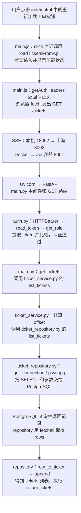
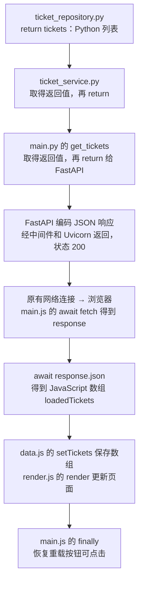

# Day145：部署工单网页并连接上海后端

## 本课目标与当前位置

Day144的部署实操、两道理解题已通过，Git提交/推送按用户2026-10-07的反馈完成，未提供提交SHA或独立远端核验。现在进入原课表Day145“部署前端并连接远程后端”。

本课目标是让上海服务器提供原有工单网页，在Windows浏览器中加载网页，并用网页操作上海后端和数据库。继续采用Day144已建立的SSH入口18002；先让网页与接口由同一个后端入口提供，再为网页请求携带token。当前只开始第一小段，不把讲义准备记作用户操作完成。

## 已核对的真实文件

- 业务主入口为ticket_app/main.py，现有FastAPI app在初始化后配置CORS，还未登记网页文件入口。
- 网页为ticket_app/web/index.html，引用同目录main.js；其余已有模块为constants.js、data.js、ticket.js、render.js。
- constants.js目前把TICKETS_API_URL写成http://127.0.0.1:8001/tickets。
- main.js的工单GET/POST/PATCH/DELETE请求目前没有Authorization请求头。
- Dockerfile工作目录为/app，COPY ticket_app/到/app/ticket_app/；.dockerignore未排除web目录。因此后续重建镜像可以包含现有HTML/JS文件，无需新增另一套网页或容器。

## 第一小段：让FastAPI提供网页文件

操作位置：Windows的VS Code，编辑本机仓库ticket_app/main.py。此段代码尚未由教师写入业务文件，需用户跟随修改。

在文件顶部现有FastAPI导入附近增加：

```python
from fastapi.staticfiles import StaticFiles
```

StaticFiles是根据请求读取HTML、JavaScript等已有文件并返回给浏览器的工具。这里是导入名称，还没有启动网页服务。

在app = FastAPI(...)完整结束后、app.add_middleware(...)之前增加：

```python
app.mount(
    "/web",
    StaticFiles(directory="ticket_app/web", html=True),
    name="web",
)
```

逐行含义：app为现有FastAPI应用；mount将一个文件处理工具登记到/web路径下；StaticFiles(...)构造工具；directory指定现有网页文件夹；html=True使访问目录时提供其中的index.html；name为该挂载入口在程序内部的名称，不是另一监听端口。保存main.py后，只登记了将来运行时如何处理网页请求，不能说上海旧容器已经同步更新。

directory为相对运行工作目录的路径。本机相关命令从C:/Users/Administrator/Documents/GitHub/fde-90-days-执行，此时ticket_app/web为实际网页目录；Docker内工作目录/app，对应/app/ticket_app/web。若以后改变启动工作目录，需相应核对路径。

本段修改后在Windows PowerShell、仓库根目录执行：

```powershell
python -m py_compile ticket_app/main.py
```

预期没有错误输出。该命令仅检查Python语法，不启动后端，也不能证明挂载/远端更新或网页工单请求已经成功。用户实际保存/检查结果待反馈。

## 第一段补讲及保存状态（2026-10-07）

用户先问/web的含义，后问name=web是否与路径自动对应、/web是否代表读取index.html。已解释三个名称可以不同，/web决定URL前缀、directory决定文件目录、name为内部名称，默认目录index.html由html=True决定。用户回复“好吧，先继续”，只记补讲已给，不当新独立实答通过。

随后定向读取本机main.py确认StaticFiles导入和app.mount五行已保存，位置在app初始化完成后、CORS配置之前，与前段指令一致。教师未代改业务文件；语法检查结果、运行验证与远端部署仍待，不能据文件保存称远端已更新。

## 第二小段：网页请求使用当前入口

操作位置为Windows VS Code中的ticket_app/web/constants.js。当前实读仍为http://127.0.0.1:8001/tickets，指导用户改成：

```javascript
const TICKETS_API_URL =
    "/tickets";
```

const声明保存地址的变量，右边/tickets为字符串；此行不发网络请求。已有main.js在fetch(TICKETS_API_URL)等调用时由浏览器发请求。开头的/表示从当前网站的根路径开始：未来网页从http://127.0.0.1:18002/web/打开，/tickets会解析为http://127.0.0.1:18002/tickets，而非/web/tickets。前提为本课已经选定网页和API由同一入口提供；不能在独立Live Server的5500页面测试此相对路径并期待它自动转到18002。

这一步只安排请求目标地址，后续才分段加入Authorization凭据。未来浏览器所见页面来源变化时，若网页与API仍共用同一入口，这个字符串可继续使用。修改保存待用户执行/反馈；上段Python语法检查若尚未做，可一并完成，不要求重复已完成检查。远端镜像尚未更新，不要求此时打开/web/验证。

## 第二段补讲及地址保存状态（2026-10-07）

用户追问只写/tickets为何变成18002/tickets，已解释变量保存的仍是字符串，浏览器在执行fetch时按照当前文档的基准URL解析；当前index.html未设置base元素，前导/沿用当前页面协议、主机及端口，并从网站根路径开始。以未来18002/web/解析到18002/tickets举例，若页面从5500打开则会请求5500，不会自动选择SSH端口。用户随后报告理解并继续，不追加小测。本轮本地读取constants.js确认地址已保存为/tickets，未执行网页网络请求或更新镜像。

## 第三小段：网页填写token并取得输入框

先建立输入位置和JavaScript引用，暂不改fetch。用户在本机web/index.html的body开始后、现有“工单数量和加载状态”注释之前增加：

```html
<label for="token-input">访问凭据：</label>
<input
    id="token-input"
    type="password"
    placeholder="请输入员工或管理员 token"
    autocomplete="off"
>
```

label为输入框的说明文字，for与输入框id相同使二者关联；input创建输入框；id供JavaScript定位；password使输入字符遮蔽显示，不决定员工或管理员身份；placeholder为未输入时的提示，autocomplete=off告诉浏览器不要自动补全该字段。此处将填写Day143已保存的工单token，不填写SSH服务器登录密码，不将真实token写进HTML。

再在web/main.js“页面状态和DOM引用”区域、现有ticketInput声明之前增加：

```javascript
const tokenInput =
    document.querySelector("#token-input");
```

document为浏览器当前网页文档，querySelector按选择条件找元素；#表示按id查找，找到HTML中id=token-input的输入框，返回的对象由tokenInput保存。这里保存的是输入框对象，tokenInput.value才取得用户当前输入的字符串；此段只准备读取位置，不发送token或验证身份。

教师仅准备讲义与操作说明，未代改HTML/JS；两个文件保存及理解待用户反馈。当前index.html既有reload-button，main.js已将其click绑定loadTicketsFromApi，可以后续复用，无需再添加一套连接按钮。本轮读到末尾仍自动调用loadTicketsFromApi且按钮初始disabled，后续接入凭据时需处理未输入token的启动提示和加载状态，不能把启动时401当完成体验。后续再构造Authorization头并接入全部现有fetch。

## 第三段保存确认及第四小段：加载请求携带Authorization

用户说继续后，本地定向读取确认index.html已有token-input的label/password输入框，main.js已有tokenInput=document.querySelector("#token-input")，名称匹配且输入元素先于模块脚本存在。记录为文件保存已确认，不等于用户已独立实答、网页运行或服务器更新。

本段在Windows VS Code的web/main.js中、actionMessage DOM引用之后与“创建工单”之前新增：

```javascript
function getAuthHeaders() {
    return {
        Authorization: "Bearer " + tokenInput.value.trim()
    };
}
```

逐行说明：function声明可重复调用的函数；getAuthHeaders是自取名称，此处不接收参数；return交回一个JavaScript对象；Authorization为HTTP认证请求头名称；Bearer后保留空格，+拼接当前输入的token；tokenInput.value取文本，trim()去掉首尾空白并返回处理后的字符串，不修改输入框本身、不做加密。函数在每次调用时读取最新值，所以更换员工/管理员token后的后续调用能使用新凭据。

随后只在loadTicketsFromApi中将const response的原fetch一段改为：

```javascript
const response =
    await fetch(TICKETS_API_URL, {
        headers: getAuthHeaders()
    });
```

TICKETS_API_URL仍指定目标路径；第二个参数对象为fetch请求选项，headers是其规定的字段，getAuthHeaders()真正执行并将返回对象交给headers。请求未设置method，仍使用GET。浏览器发送Authorization，上海HTTPBearer读取凭据，get_role比较配置后才允许查询数据库，最后响应由response保存。与原POST的Content-Type字段回忆衔接，新的头只解决凭据传递，不自动改变后端权限。

本段教师没有代改业务文件，新函数及GET接入保存尚待反馈。不修改其他fetch以免一次倾倒大量代码；下一段为POST/PATCH/DELETE保留原JSON Content-Type并加入同一认证头，随后处理初始空token的页面提示和加载按钮状态。当前末尾自动loadTicketsFromApi仍存在，禁止在尚未完成页面认证流程时宣称整页可用。构建、远端更新及实际浏览器验证均未开始。

## 第四段保存核对及第五小段：全部工单请求携带凭据（2026-10-08）

本地读取main.js确认getAuthHeaders声明及loadTicketsFromApi中的headers:getAuthHeaders()已保存。但实际函数写成Authorization: "Bearer" + tokenInput.value.trim()，少了Bearer后的空格。本段先指导用户将该行改为：

```javascript
Authorization: "Bearer " + tokenInput.value.trim()
```

以虚构token demo-token说明：目标字符串是Bearer demo-token，缺少空格会成为Bearerdemo-token。此处是认证头格式问题，不是JavaScript语法错误；尚无运行结果，不指定实际响应状态码。

操作仍在Windows VS Code的web/main.js。handleAddTicket（新增）、handleSaveAction（保存标题）、handleToggleStatusAction（切换状态）三个请求已有JSON Content-Type，分别把headers一段替换为：

```javascript
headers: {
    "Content-Type": "application/json",
    ...getAuthHeaders()
},
```

Content-Type说明body的数据格式；getAuthHeaders()执行函数并返回含Authorization的对象；三个点在此处把返回对象的字段展开到当前headers对象中。因此发送的请求同时有Content-Type与Authorization，不发送getAuthHeaders这个函数名。Content-Type行末逗号分隔两个对象成员，右大括号后的逗号保留以连接后面的body选项。这一段用于三个已有JSON请求，不改其method或body。

handleDeleteAction的fetch第二参数由只有method扩展为：

```javascript
{
    method: "DELETE",
    headers: getAuthHeaders()
}
```

本例DELETE没有JSON body，不需要增加该JSON Content-Type，直接使用函数返回的请求头对象即可。method行增加逗号以分隔headers选项。发送员工token仍由后端拒绝删除，函数只传递输入凭据，不授予管理员权限。

教师未代改业务文件；空格修正和上述四处接入均待用户保存/反馈。本段不再新增理解题，整课实际运行后集中核对。下一小段处理无token启动提示与加载按钮，再统一更新镜像；没有远端更新或网页测试证据。

## 第五段补讲：fetch请求与response响应（2026-10-08）

用户展示POST请求截图，headers包含Content-Type与...getAuthHeaders()，body保持JSON.stringify(ticketToCreate)。这证明截图中的修改形态符合指导，不证明落盘、其余请求全部改好或远端已更新。

用户复述POST带token到上海服务器的Python代码核对身份，这部分正确。补清两个具体点：method、headers、body是在fetch发出请求前一起指定的选项，不是先访问API再补发方法；response是接住返回响应的变量名，发送动作是浏览器执行fetch。getAuthHeaders只组装请求头，后端才比较token并判断角色/权限。

以新版部署后的新增工单为例，浏览器取标题与token，发送POST /tickets；上海后端验证凭据、权限与数据，成功时写入PostgreSQL，再返回201和工单JSON。await fetch取得响应对象，赋给response；response.status取得状态码，await response.json()读取并解析JSON正文，由createdTicket接住工单对象。response不等于发出的请求，也不直接等于已解析的工单对象。HTTP拒绝响应也可以由response接住，变量名称本身不代表成功。

本段按用户实际表述记录部分理解及补讲，不据教师解释宣布全部理解通过；无新运行、镜像部署或Git结果，不另加微段测验。

## 第五段再补讲：Authorization、Bearer与不匹配响应（2026-10-08）

用户追问展开后为何后端知道要比较token，是否因为Bearer，以及不匹配会返回什么。定向读取main.js确认Bearer空格修正及POST的认证头展开已保存；只确认这些位置，不推断PATCH/DELETE完成。读取auth.py核对实际拒绝行为。

说明浏览器先执行getAuthHeaders并展开返回对象，发送的是Authorization: Bearer 加输入值，不是函数定义。Authorization是HTTP认证请求头名，Bearer说明使用的认证方案；后端已配置HTTPBearer从这个头提取token，再由read_token/get_role中的Python逻辑比较角色配置。关键词用于识别格式，真正比较和授予staff/admin的是项目代码。

两种服务器凭据正确配置时，输入token与员工不符还会继续比管理员，两者均不符才raise HTTPException(status_code=401, detail="访问凭据无效", headers={"WWW-Authenticate":"Bearer"})。FastAPI返回401和JSON对象{"detail":"访问凭据无效"}，新增逻辑不会写入工单。员工token有效但请求删除时，由require_admin返回403和{"detail":"需要管理员权限"}；认证无效与权限不足需分清。本段不扩展未提供或格式错误头的具体版本行为。

对应当前POST前端，401仍可由response接住，response.status为401、response.ok为false，现有分支抛错并记录控制台。当前没有读取错误detail并渲染到页面，不能说用户自动能在页面看见中文错误提示。讲解不算新运行验证或用户独立复述通过，未代改业务文件。

## 2026-10-08完整流程补讲：以新增工单为一个闭环

用户明确要求当前每次都从零逐文件串起调用、参数和返回，不由教师省略，已写入固定教学方法。以下来自当前本地源码，描述这版代码部署后的流程；没有运行或远端更新证据。虚构标题为“打印机无法启动”，示例token及id仅作说明。

1. Windows浏览器加载index.html及模块脚本后，web/main.js末尾addButton.addEventListener("click", handleAddTicket)登记点击处理函数；登记时不执行新增，点击时浏览器调用handleAddTicket。
2. handleAddTicket先禁用新增按钮，读取ticketInput.value，组成ticketToCreate对象；getAuthHeaders读取tokenInput.value.trim()，返回Authorization: "Bearer " + token。展开对象把这个字段与Content-Type一起放进headers。函数源码不随请求发送。
3. 浏览器内置fetch使用constants.js中的/tickets及method/headers/body发HTTP，JSON.stringify将工单对象转成JSON文本。不是先访问后补方法，也不是main.js按文件名远程调用Python函数。await处等待响应，浏览器其他活动仍可继续。
4. 未来页面在http://127.0.0.1:18002/web/时，目标是http://127.0.0.1:18002/tickets。本机SSH监听18002，通过SSH连接把数据交到上海宿主127.0.0.1:8002，Docker转入api容器8001，Uvicorn接收HTTP并调用FastAPI应用。18002只属于本机入口，服务器代码不在浏览器执行。
5. main.py的log_request中间件在call_next前记开始日志，将请求交给后续处理；现有CORS中间件负责浏览器跨来源规则，不承担token核对。本课同源入口不需要另外跨域访问。FastAPI按POST与/tickets匹配@app.post定义，其dependencies=[Depends(get_role)]要求在create_ticket函数体前完成认证。TicketCreate同时规定正文title的类型/非空要求；不把框架内部认证与正文校验的细微顺序讲成固定先后。
6. main.py已从auth.py导入get_role。Depends不是浏览器发送的参数，而是给FastAPI的调用安排。get_role的token依赖read_token，read_token的credentials依赖berarer_scheme；因此FastAPI需要先取得底层工具的结果，再传给read_token，再传给get_role。
7. auth.py的berarer_scheme=HTTPBearer()在启动时构造认证工具。请求时FastAPI调用该对象；本机库fastapi/security/http.py的HTTPBearer.__call__读取request.headers.get("Authorization")、拆分scheme和credentials、检查bearer格式，再返回带scheme和credentials的对象。比如Bearer abc123得到scheme="Bearer"及credentials="abc123"。这段读取由已安装FastAPI库实现，不是函数名本身有魔法。
8. auth.py的read_token(credentials=Depends(berarer_scheme))拿到该对象，return credentials.credentials交出纯token字符串。FastAPI把字符串交给get_role的token参数。config.py的Settings按TICKET_前缀读取配置，在容器中对应Compose注入的TICKET_STAFF_TOKEN/TICKET_ADMIN_TOKEN；不用展示真实值。get_role将输入和配置值转为UTF-8字节，用compare_digest比较，返回staff/admin或抛出异常。POST使用dependencies列表时只要求该依赖通过，角色返回值不会自动成为create_ticket的参数，也不是返回给浏览器的工单结果。
9. 认证和正文检查通过后，main.py的create_ticket(ticket_to_create: TicketCreate)读取ticket_to_create.title，调用从ticket_service.py导入的create_new_ticket(title)。service内部再调用ticket_repository.create_new_ticket(title)。这两次是同一Python后端进程里的函数调用，没有再发HTTP。
10. ticket_repository.py的create_new_ticket使用get_connection；后者调用psycopg.connect按settings连数据库，服务器Compose环境的目标为db:5432。connection.execute执行参数化INSERT INTO tickets (title) VALUES (%s) RETURNING id,title,status，SQL执行者是PostgreSQL；(title,)传参，不拼接SQL。数据库生成id/default status，fetchone取得一行，正常退出with提交事务并关闭连接；row_to_ticket把行转换为Python字典后return。
11. 该字典先返回service调用处，再由service的return交回main.py的created_ticket，再由create_ticket的return交给FastAPI。response_model=Ticket约束响应结构，status_code=201指定成功状态。FastAPI将Python数据编码成JSON响应；中间件在call_next返回后记日志、补X-Request-ID并返回响应，Uvicorn通过原有连接发回。Python中的response与浏览器中的response是各自进程的对象，名称相同也不共享对象。
12. Windows浏览器取得响应，main.js原await fetch完成，response变量接住浏览器Response对象。response.ok确认2xx，await response.json读取解析正文，createdTicket保存JavaScript工单对象。与Python字典内容可相同，但跨网络传递的是JSON，不是共享内存对象。
13. main.js将createdTicket追加到newTickets，调用data.js的setTickets更新浏览器内存数组，再调用render.js的render；renderTicketCount更新计数，renderTicketList创建/更新列表元素，浏览器显示工单。最后清空标题输入，finally恢复按钮。数据库早在服务器事务提交时已更新，setTickets不负责写数据库，render不负责再次发网络请求。

失败闭环：在两种配置正常而输入token均不匹配时，auth.py抛出HTTPException(401, detail="访问凭据无效")，FastAPI生成错误响应；不会进入create_ticket/service/repository新增逻辑。响应仍沿网络返回main.js的response；response.status为401，response.ok为false，现有if分支throw Error，跳入同函数catch记录console.error，finally恢复按钮；跳过response.json、setTickets和render。当前页面尚未解析显示detail，不能说中文错误自动出现在网页上。

此次只对具体链路补讲，不增加小测，不代改业务代码，不记实际新增/部署成功。后续继续按该详度连接涉及的代码，用户熟悉后再明确简化。

## 第六小段：未输入token时先提示，不发工单请求（2026-10-08）

用户明确反馈完整流程已理解，并要求以后每次保持这种细度，熟悉后自行要求简化；记录为用户理解报告，不算独立场景题已答。本轮读取确认Bearer空格及GET/POST/两个PATCH/DELETE认证头全部保存，尚未运行远端新版本。

目标：网页初始为尚未加载；空token时仅提示，填好后点既有重载按钮才请求服务器；浏览器初始数组不再混入早期示例。操作均在Windows VS Code。本段教师没有代改业务文件。

index.html两处：ticket-count文字改为“尚未加载工单”；reload-button去掉disabled属性，保留按钮及文字。初始没有网络请求，所以不该显示正在加载；空值分支位于try之前，提前return不经过try的finally，按钮必须由HTML初始允许点击。

main.js找到async function loadTicketsFromApi()，在函数开头、原try之前加入：

```javascript
    if (tokenInput.value.trim() === "") {
        actionMessage.textContent =
            "请先输入访问凭据，再点击“重新加载工单”。";
        return;
    }

    actionMessage.textContent = "";
```

逐项说明：value取得输入框当前字符串，trim去首尾空白，=== ""严格比较是否为空；条件成立时textContent把说明显示到index.html的action-message段落，return立即结束这次加载函数，不进入try、不执行fetch，也不访问上海。actionMessage由main.js中document.querySelector取得当前浏览器页面元素，并不是后端返回值。非空时跳过分支，清掉上次提示，再执行已有try：禁用重载、renderLoading、fetch、检查响应、json/setTickets/render，finally恢复按钮。此处只检查有没有输入，不判断token正确或员工/管理员身份。if外不需要else，因为空分支已return。保留main.js最后的loadTicketsFromApi()和按钮事件绑定，函数被调用不等于必然发网络请求。

data.js将原两条示例数组整体替换为：

```javascript
// 初始尚未读取服务器数据，浏览器先保存空数组。
let tickets = [];
```

移除文件顶部不再使用的TICKET_STATUS导入及旧示例注释；setTickets和export保持。[]仅表示浏览器本次打开页面的初始列表，绝不执行数据库DELETE。服务器查询返回后setTickets用真实结果替换；避免尚未查询就新增工单时把旧本地假数据拼进真实结果。

启动空值路线：浏览器解析index.html创建输入框/提示位置/可点击重载按钮→加载main.js及模块→DOM引用与事件登记→执行末尾loadTicketsFromApi()→空值分支显示提示并return。本段没有响应对象，没有跨网络返回；浏览器仅更新自己的页面。

有值路线：用户输入凭据并点击重载→浏览器事件调用同一loadTicketsFromApi→跳过空值分支并清提示→render.js的renderLoading更新状态→fetch GET /tickets，headers来自getAuthHeaders且没有请求body→页面18002经SSH到上海8002，Docker到容器8001，Uvicorn/FastAPI处理。main.py日志中间件转交，GET /tickets路由的Depends(get_role)触发auth.py认证工具→read_token→get_role。通过认证与参数校验后调用main.py get_tickets，默认status=None、page=1、limit=10、order=asc；service.list_tickets算offset=(1-1)*10=0并交给repository.list_tickets；后者get_connection用psycopg连接db:5432，SELECT取前10条并fetchall，row_to_ticket转换各行为字典，组成Python列表返回。repository→service→main.py→FastAPI将列表编码JSON并返回200，经过中间件/Uvicorn和原连接回浏览器。main.js的await fetch取得response，ok时json解析为loadedTickets，data.js的setTickets替换内存数组，render.js更新计数与列表，return loadedTickets之前也会执行finally恢复按钮；按钮事件回调不依赖该返回列表来显示，页面已由render更新。此查询默认最多10条，不称加载全部数据库记录。

非空但无效token路线：前端条件通过不表示身份通过；auth.py返回401/detail访问凭据无效，main.js取得非ok响应后抛错，catch记录控制台并调用renderLoadError，finally恢复重载按钮。服务器没有执行该查询接口的工单SELECT。页面现有失败文字为通用加载失败，不自动展示detail。

三文件修改尚待用户保存/反馈。此处先完成代码准备，不要求访问远端/web/或重新开5500测试；远端镜像更新后统一观察初始提示、合法凭据加载与权限分支。

## 第六段补讲：repository返回值怎样抵达main.js（2026-10-08）

用户提供repository中tickets=[]/append/return tickets截图，表示对流程更清楚但仍不明白返回值怎样到main.js。重点补齐直接return函数调用造成的隐含接收步骤，并划清Python函数返回与HTTP响应边界。

浏览器main.js已在await fetch(TICKETS_API_URL,{headers:getAuthHeaders()})处等待响应。服务器repository.list_tickets得到字典列表后return tickets，这个值先交回service.list_tickets里调用ticket_repository.list_tickets(...)的位置，不直接传给浏览器。service的return ticket_repository.list_tickets(...)先求右侧调用结果，再把结果返回给service的调用者；可教学拆成result_from_repository=原调用、return result_from_repository。临时名称只是解释，没有业务代码修改。

main.py get_tickets中的return list_tickets(...)调用的是已从ticket_service导入的函数；它同样先取得service返回列表，再return交给调用路由的FastAPI框架。@app.get登记方法/路径与get_tickets的关系，框架调用并处理返回结果，不是main.py自行发请求去找main.js。普通函数层之间传递的是Python值；repository的局部tickets名称不跟着返回成为前端变量名。

FastAPI根据response_model=list[Ticket]处理返回结构并编码为JSON响应正文，成功状态默认200；响应经中间件处理（记录日志、X-Request-ID）、Uvicorn发送，通过原有Docker/SSH链路抵达发起这次请求的浏览器。JSON传输内容形如[{"id":42,"title":"打印机无法启动","status":"open"}]，示例非实际记录；是列表内容，没有自动添加tickets包装字段，也不跨网络共享Python内存对象。

浏览器接收响应后，await fetch取得Response对象赋给response；它包含状态/响应头及可读取正文，不直接等于工单数组。状态通过后，await response.json()读取JSON正文并解析成JavaScript数组，赋给loadedTickets。随后setTickets(loadedTickets)调用data.js函数替换该模块的tickets，render(loadedTickets,editingId)调用render.js更新数量和列表；Python局部tickets与浏览器tickets彼此独立，即使同名也没有自动联系。返回完整链：repository Python列表→service return→main.py路由return→FastAPI JSON响应→Uvicorn/网络→浏览器Response→response.json→loadedTickets→setTickets/render。

未增加新操作或理解题，待用户反馈这一补讲。定向读取还确认main.js的空token提示、提前return及清提示已保存，但未核对HTML/data.js本次修改，未运行语法检查或部署镜像。

## 完整GET回顾与流程图：从用户点击开始（2026-10-08）

用户报告已经理解返回链，要求将之前的请求/查询链也按详细讲解及流程图补齐。当前例子是“重新加载工单”的GET，不是新增POST；按未来新版部署后的正确凭据/成功查询流程说明，示例数据不当真实运行结果。这一轮只对照已有代码，不要求添加业务代码。

前半段流程图（同一阶段的相关动作合在一格，逐个动作见下方说明）：



1. index.html创建id=reload-button的按钮，并用type=module脚本入口加载main.js。main.js用document.querySelector("#reload-button")取得按钮对象保存为reloadButton，末尾addEventListener("click",loadTicketsFromApi)登记点击回调；登记不等于请求。用户点击后浏览器调用该函数，服务器此时还不知道发生点击。
2. main.js先检查tokenInput.value.trim() === ""；空值时actionMessage.textContent显示提示并return，无fetch/后端/数据库操作。有效性仍由服务器判断。非空时清提示，进入try禁用重载按钮，调用render.js的renderLoading设置文字并清列表。
3. getAuthHeaders读取当前token，return带Authorization字段的对象到fetch的headers选项。constants.js的TICKETS_API_URL为/tickets；fetch未指定method，默认GET，无工单JSON正文。浏览器将相对地址解析到页面同源18002入口，构造HTTP请求。await暂停当前异步函数后续处理，等待取得Response对象，不冻结整页。
4. 已有SSH监听本机18002并转发到上海127.0.0.1:8002，Docker发布入口再交到api容器8001。Uvicorn已按ticket_app.main:app启动，将HTTP交给FastAPI应用；main.py日志中间件在call_next前记开始，后续处理包括已配置的CORS和路由。GET/tickets匹配@app.get，dependencies=[Depends(get_role)]要求先完成认证。认证通过和参数校验完成后才调用get_tickets函数体。
5. main.py导入auth.py的get_role。FastAPI依赖安排使HTTPBearer工具先读取Authorization并提取凭据对象，read_token返回对象credentials字段作为字符串，再传给get_role的token参数；get_role从config.settings取得配置的staff/admin token，转UTF-8字节并compare_digest比较。返回staff/admin表示依赖通过；GET的dependencies列表不把这个角色当作工单响应，也不自动作为get_tickets参数。配置正常而两者都不符返回401，不调用查询业务链。
6. main.py get_tickets默认status=None/limit10/page1/order asc；调用service的list_tickets传入这四项。service计算offset=(page-1)*limit即0，向repository传status/limit/offset/order。两次都是同一Python后端中的函数调用，通过导入函数或模块名字定位，没有新HTTP请求。
7. repository的list_tickets先把asc转换为SQL需要的ASC；get_connection调用psycopg.connect，按settings的db主机/端口等连接，服务器Compose目标db:5432。status为None选择无WHERE分支，connection.execute提交SELECT id,title,status FROM tickets ORDER BY id ASC LIMIT %s OFFSET %s及(10,0)。PostgreSQL执行查询，psycopg传送命令/结果，cursor.fetchall取得所有本次查询结果行，不是全部数据库无限量记录；本次最多10条。
8. rows可理解为[(42,"打印机无法启动","open"), ...]这样的行集合，示例非实际数据。with退出关闭连接后继续Python处理：tickets=[]，for row in rows逐行调用同文件row_to_ticket，后者将row[0]/row[1]/row[2]装入id/title/status字典并return；tickets.append把返回字典放进列表。全部行处理完return tickets，恰好接上上一段用户已理解的返程。无行则循环不运行，return []是正常结果。

后半段流程图：



结果不按变量名自动跨文件/跨网络绑定。Python列表经普通函数return交到框架，框架编码JSON并经网络回到原请求的浏览器；Response对象要经json()读取解析才成为loadedTickets。前端setTickets只更新浏览器内存，render只更新页面，SELECT只读取服务器记录。错误token收到401后由response.ok分支抛错，catch记录日志/显示加载失败，finally同样恢复按钮。当前HTML初始文字及按钮状态、本地JS空值检查已读取确认；data.js空数组仍待核对。没有新运行/镜像/部署或独立小测证据。

## 第七段：把新版网页与后端构建、交付并运行（2026-10-08）

用户报告完整数据流程理解并要求持续同样详解。本轮确认data.js空数组已保存；旧示例注释和未用TICKET_STATUS导入可顺手清理但不影响运行。其余页面/认证/挂载保存已核对。教师只准备操作说明，不代做例行构建或部署，所有结果等待用户手动执行反馈。

本次工作流：Windows源码和Dockerfile→Docker构建ticket-app:day145→save归档→SCP交付归档/compose→上海Docker load→Compose按新标签替换api→FastAPI提供/web/→浏览器运行JS并请求原数据库。网页文件被打包在应用镜像里，由浏览器下载后执行JS；数据库程序和数据卷独立存在，没有因为构建应用镜像而重新复制数据。

### 本机准备与构建（Windows PowerShell）

VS Code中根compose.yaml仅将services/api/image从ticket-app:day143改为ticket-app:day145，name:ticket-day141、db、环境变量占位、端口和卷保持原安排。不要把精简示例覆盖整份配置。此时只是修改配置文件，尚未切换任何正在运行的容器。

```powershell
Set-Location 'C:\Users\Administrator\Documents\GitHub\fde-90-days-'
python -m py_compile ticket_app/main.py
```

py_compile预期无错误，只有语法检查，不启动API；之前已通过且文件未改可不重复。Docker Desktop应已启动并使用现有Linux引擎。

```powershell
docker build --platform linux/amd64 --load -f ticket_app/Dockerfile -t ticket-app:day145 .
```

--platform指定与服务器x86_64对应的Linux/amd64；--load把结果存入本机Docker镜像库供save；-f指定制作说明文件；-t指定新名称/标签；末尾点是构建上下文，即当前仓库根目录。Dockerfile从python:3.12-slim准备环境、WORKDIR /app、复制requirements并安装依赖、COPY ticket_app/ /app/ticket_app/带入Python和web文件，CMD登记将来容器启动Uvicorn的命令；构建时登记CMD不等于服务器已运行新版。Docker的COPY遵从.dockerignore，凭据不因COPY进入镜像。构建失败不要继续导出/上传。

```powershell
docker image inspect --format '{{.RepoTags}} | {{.Os}}/{{.Architecture}}' ticket-app:day145
docker image save -o "C:\Users\Administrator\Downloads\ticket-day145-app.tar" ticket-app:day145
```

inspect预期名称包含ticket-app:day145且linux/amd64；save把已构建应用镜像导出为文件，不把postgres:18或数据卷打包。两步顺序执行，前步错误停下。

### 上传两份文件（仍在Windows）

```powershell
scp -o ServerAliveInterval=30 -o ServerAliveCountMax=3 "C:\Users\Administrator\Downloads\ticket-day145-app.tar" "C:\Users\Administrator\Documents\GitHub\fde-90-days-\compose.yaml" ubuntu@42.192.114.83:/home/ubuntu/ticket-app/
```

前两个路径为本机两个源文件，最后是远端目录；SCP上传应用归档并更新服务器compose.yaml，沿用远端已有.env.compose与schema.sql。复制文件完成并不切换旧容器，必须后续load/up。使用服务器Ubuntu账号认证，全部文件传输成功后再到下一步。

### 服务器导入与更新（SSH进入Ubuntu）

从本机PowerShell执行ssh -o ServerAliveInterval=30 -o ServerAliveCountMax=3 ubuntu@42.192.114.83；确认提示符为ubuntu@VM-0-8-ubuntu再执行：

```bash
cd /home/ubuntu/ticket-app
sudo docker image load -i /home/ubuntu/ticket-app/ticket-day145-app.tar
sudo docker compose --env-file .env.compose config --quiet
sudo docker compose --env-file .env.compose ps -a
```

load预期Loaded image: ticket-app:day145；config --quiet检查配置与变量但不展示秘密，成功无错误；ps此时api仍可显示day143，因为还没重建，db应已healthy。如db未运行/不健康，先反馈处理，不盲用--no-deps继续。

```bash
sudo docker compose --env-file .env.compose up -d --no-deps --pull never api
sudo docker compose --env-file .env.compose ps -a
```

Compose读取新api标签与.env.compose配置；up在镜像/配置变化时重建api，-d后台运行，--no-deps不启动依赖服务，--pull never只用刚导入的本地镜像，api限定目标。db原容器及pgdata继续使用，过程中api可能短暂停顿；不执行down或删卷。预期api IMAGE ticket-app:day145且Up，db postgres:18/healthy。容器名称仍ticket-day141-api-1来自项目名，非升级失败。

### 经已有隧道检查网页（Windows浏览器）

保留既有-N -L隧道窗口。若已关闭，另开一个本机PowerShell执行（只在没有该隧道时重开）：

```powershell
ssh -N -L 127.0.0.1:18002:127.0.0.1:8002 -o ExitOnForwardFailure=yes -o ServerAliveInterval=30 -o ServerAliveCountMax=3 ubuntu@42.192.114.83
```

浏览器打开http://127.0.0.1:18002/web/。FastAPI的app.mount在新版容器中从/app/ticket_app/web/index.html读取文件，经响应送给浏览器；浏览器再取main.js及导入模块并执行。观察“尚未加载工单”及main.js写入的空凭据提示，能区分只有HTML可见与JS已执行。员工token仅填原值（函数添加Bearer），点击重载；GET通过既有入口到auth/main/service/repository查原数据库，返回JSON并render真实工单。零条也是正常结果，不把示例id或旧本机数据当预期。

这一轮报告api标签/运行状态、初始提示和员工加载结果，错误则只取对应命令/错误排查；未收到前不记部署完成。业务写入/权限完整验收与整课题/Git随后进行。

### 构建中断排查：Docker Hub认证连接超时（2026-10-08）

用户截图显示本机py_compile无报错，构建失败在Dockerfile第一行FROM python:3.12-slim的元数据查询。ERROR中的auth.docker.io/token是Docker Hub认证服务，连接超时不代表应用token错误或Python语法错误；Docker已接收并执行构建任务，尚未完成新镜像。本轮读取compose.yaml确认api的image已为ticket-app:day145。

定向诊断确认Docker Desktop和desktop-linux构建器运行，Desktop手动HTTP/HTTPS代理为http://127.0.0.1:7890且Mihomo监听7890。同一匿名仓库认证地址，直接连接超时、经7890返回200，响应正文未输出。教师启动的诊断进程没有HTTP_PROXY/HTTPS_PROXY；不将其当作用户现有VS Code终端环境的独立证据。在诊断子进程设置下列代理变量后，只读Docker镜像元数据查询成功；完整构建未重试，接续让用户在原Windows PowerShell执行：

```powershell
$env:HTTP_PROXY = "http://127.0.0.1:7890"
$env:HTTPS_PROXY = "http://127.0.0.1:7890"
$env:NO_PROXY = "localhost,127.0.0.1,::1"
docker build --platform linux/amd64 --load -f ticket_app/Dockerfile -t ticket-app:day145 .
```

$env:表示当前进程环境变量，赋值后启动的客户端可读这些值。HTTP_PROXY/HTTPS_PROXY指向本机代理，HTTPS_PROXY值使用http://适合本机HTTP代理承载HTTPS连接；NO_PROXY使所列本机地址不经过该HTTP代理。只对当前PowerShell及其子程序生效，新开窗口需重新设置；没有修改永久系统配置，不要求更改现有NICE规则/TUN或国内SSH路径。

流程：Windows PowerShell启动Docker构建客户端→读Dockerfile的FROM→请求Docker Hub认证和基础镜像信息→本机7890代理转送→仓库响应→构建继续取得基础镜像、安装requirements与COPY源码→完成ticket-app:day145。客户端与构建服务分工不能简化成“所有Docker流量始终只走同一设置”；本轮只确认显式代理能完成元数据查询。先收完整构建成功或新的具体错误，再继续归档/交付，不能把200或元数据查询当作镜像已构建。

### 本机构建成功后的接续位置（2026-10-08）

用户提供Docker Desktop镜像列表，day145短ID为d2c9863f998d，并明确答复只在本机点击运行。记录本机构建成功/用户报告本机运行；没有上海新镜像、容器健康或网页验证证据。当前不重新构建，回到第七段的inspect/save→scp→远端load/config/db核对/up api→网页初验完整批次。定向读取确认compose的api已为ticket-app:day145；项目名、db及卷不改。

save读取本机镜像，输出可交付tar文件；不会把本机运行容器的状态或数据库记录导出。scp复制tar与compose到上海磁盘；load从tar恢复上海Docker镜像及标签但不启动程序；up由Compose按照服务器.env.compose、原数据库连接和新应用镜像创建/更新api。四步各有不同执行者、输入和结果，只有up完成后才能把新代码当成上海正在运行的版本。本段老师没有执行这些操作。

网页初验继续串两次请求：浏览器GET /web/→本机SSH18002→上海8002→Docker/api8001→Uvicorn/FastAPI app.mount→镜像内/app/ticket_app/web/index.html→响应回浏览器；随后下载main.js及模块在浏览器运行。输入员工原token并点击重载→main.js loadTicketsFromApi/getAuthHeaders/fetch GET /tickets→同一网络入口→auth.py提取比较→main.py get_tickets→ticket_service.list_tickets→ticket_repository.list_tickets及psycopg→db:5432的PostgreSQL SELECT→Python列表逐层return→FastAPI编码JSON/Uvicorn回传→main.js response.json/loadedTickets→data.js setTickets→render.js render更新页面。空数组是成功无记录，不迁移旧本机数据。先收api image/Up及db healthy、初始提示和员工加载三项结果，再做其余权限验收。

## 第八段：网页写入与员工、管理员权限验收（2026-10-08）

用户对上一轮交付/更新/网页初验反馈正常，截图确认127.0.0.1:18002/web/已显示凭据框、当前1条“创建工单测试－待处理”。远端标签/服务状态按用户反馈保留，教师未独立复查；遮罩凭据不能证明角色。本段先使用明确的员工token，只操作新建“Day145网页验收－初始”测试工单，不删除原记录。

浏览器先打开开发者工具Network（网络），过滤tickets。面板只记录打开期间发生的请求；每次按钮操作后查看对应行Status，点开Headers的Request Method/URL以及Response。不要要求反馈真实Authorization值。预计员工POST /tickets为201，标题/状态PATCH /tickets/{真实id}为200，重新加载GET为200，员工DELETE为403，换管理员后DELETE为204。列表重载用于核对服务端数据，不能只凭一次本地render判断数据库已保留或删除。

新增调用闭环：main.js底部addButton click登记handleAddTicket；点击读ticketInput.value组成ticketToCreate，getAuthHeaders读tokenInput并返回Authorization，JSON.stringify变JSON正文，fetch POST /tickets。请求经SSH18002→上海8002→Docker api8001→Uvicorn/FastAPI main.py的路由/中间件；Depends(get_role)由auth.py HTTPBearer读取格式、read_token提取token、get_role比较配置。通过后main.create_ticket读取TicketCreate.title→ticket_service.create_new_ticket→ticket_repository.create_new_ticket→psycopg/get_connection→db:5432 PostgreSQL INSERT RETURNING。fetchone/row_to_ticket形成字典，事务正常提交后逐层return给main/FastAPI，编码JSON201经Uvicorn原链路返回；main.js await fetch的response.ok后response.json接createdTicket，追加newTickets→data.setTickets→render.render显示→清标题/finally恢复按钮。新增后重载可核对记录持久化。

标题修改：render.js为编辑/保存按钮设置data-id/data-action；main.js列表click触发handleTicketListClick，点击编辑只设置editingId/render，不发请求也不改数据库。保存时handleSaveAction读该id输入框组成title JSON并发PATCH，认证后main.update_ticket由TicketUpdate.model_dump取已提供字段→service.update_ticket_by_id→repository同名函数执行UPDATE title及SELECT。字典返回后JSON200→main.js response.json/updatedTicket→ticket.js replaceTicket替换同id记录→data.setTickets/render并显示更新提示。状态按钮同分发调用handleToggleStatusAction，ticket.js getNextTicketStatus算open→in_progress，JSON status字段发相同PATCH，repository更新status并SELECT，返回路径与标题相同。重载后更名和处理中应保留。

员工删除：列表click分发给handleDeleteAction(id,按钮)→getAuthHeaders/fetch DELETE→同一网络入口→main.py DELETE路由Depends(require_admin)→auth.get_role识别staff→require_admin抛HTTPException403/detail需要管理员权限。FastAPI形成JSON错误，经Uvicorn回到原await fetch；response.ok为false，throw进入catch仅console.error，跳过本地deleteTicket/setTickets/render，finally恢复按钮。数据库DELETE没有执行，所以工单保留；网页当前没有自动显示该detail的中文弹窗，Network能观察403及正文，Console能看日志。

管理员删除：tokenInput换管理员原值后getAuthHeaders在下一请求读取新值。get_role返回admin，require_admin通过，main.delete_ticket→service.delete_ticket_by_id→repository.delete_ticket_by_id执行DELETE RETURNING，fetchone/row_to_ticket结果逐层返回供main判断是否存在；main最后裸return，没有把删除字典作为正文返回，框架形成204无正文。main.js只检查response.ok，不response.json，再调用ticket.js deleteTicket从浏览器数组移除该id→data.setTickets/render→finally。再GET重载应看不到该测试记录。若目标原本不存在则404，不能写成成功204。

本段操作结果全部待反馈，未代发请求或改业务代码。反馈可简记新增201、标题/状态200且重载保留、员工403且保留、管理员204且重载消失；随后同源/CORS收尾、整课两题和Git。

## 第九段：同一个入口、同源与CORS收尾（2026-10-08）

用户对第八段整体反馈没有问题，按用户报告记录新增/修改/重载和员工/管理员删除验收正常；未提供逐项状态码输出、未由教师独立操作，不等于理解题已通过。当前不再重建镜像或新增代码。

浏览器的origin由协议、主机和端口组成。网页http://127.0.0.1:18002/web/与接口http://127.0.0.1:18002/tickets都是http/127.0.0.1/18002，路径不同仍同源。对当前目标，上海宿主8002、容器8001、Docker内部IP是入口后面的转发/运行位置，不改变浏览器所比较的来源。main.py mount让FastAPI在同一监听入口提供/web文件；constants.js的/tickets由浏览器解析为当前来源根路径下的接口地址。

读取现配置确认allow_origins仅http://127.0.0.1:5500，它是给CORS工具的允许跨源网页来源列表，不是API监听地址、转发规则或员工角色配置。当前18002网页访问18002接口是同源，不需要通过这项旧跨源来源许可；不因列表没有18002而自动禁止当前请求。CORS由后端中间件处理相关请求/响应头并由浏览器执行跨源限制；auth.py才比较token与角色。现allow_headers仅Content-Type，如以后再由5500页面跨源发送Authorization，需另核对预检与允许头，不宣称现配置已支持；本段不改allow_headers或教学路线。

以点击重新加载为闭环：浏览器从/web/得到HTML/main.js及模块→main.js的按钮监听调用loadTicketsFromApi→getAuthHeaders读取凭据/返回Authorization对象→fetch用constants的/tickets解析http://127.0.0.1:18002/tickets→同源判断不要求跨源许可→SSH18002到上海8002→Docker api8001/Uvicorn→FastAPI日志/路由及auth HTTPBearer/read_token/get_role→main.get_tickets→service.list_tickets→repository.list_tickets/psycopg→PG SELECT→Python列表逐层return→FastAPI编码JSON/Uvicorn沿连接返回→main.js await fetch的Response→response.json的loadedTickets→data.setTickets/render.render。CORS不代替网络转发、数据库连接或身份/权限检查。

本课两道集中理解题（尚待真实作答）：

1. 假设之后使用http://127.0.0.1:19002/web/打开同一版网页，而且对应入口已经能连到服务器。constants.js仍为/tickets。点击重新加载时，浏览器请求哪个完整地址？网页与该接口是否同源，依据是什么？
2. 当前18002同源网页里填员工token后点击删除，工单仍在。这是CORS拒绝还是项目中哪段检查拒绝？数据库DELETE是否执行？按这次实际流程解释即可。

本段按答案讲评后再限定Git，不能把上述解释或用户前一批无问题反馈代作题目答案。官方参考：[MDN同源定义](https://developer.mozilla.org/en-US/docs/Web/Security/Defenses/Same-origin_policy)、[FastAPI CORS](https://fastapi.tiangolo.com/tutorial/cors/)。

### 第九段补讲：实答讲评与完整CORS参数解释（2026-10-08）

第一题实答仍/tickets、同源、端口/IP相同：同源方向正确，完整目标需补http://127.0.0.1:19002/tickets，比较项还包括协议。第二题实答不是CORS、get role拒绝、未执行DELETE：非CORS和未执行DELETE正确；有效员工token使get_role返回staff，require_admin才检查admin并抛403。用户明确尚不理解同源/CORS，要求整段截图细讲；不算理解题全部通过，Git收尾仍未开始，不推进下一Day。

来源先对应网页地址：页面http://127.0.0.1:5500/index.html的来源是http://127.0.0.1:5500；它执行JS去请求http://127.0.0.1:18002/tickets，后者是目标来源。浏览器按协议/主机/端口比较，路径不同可同源、同一电脑不同端口仍跨源。当前18002/web与18002/tickets同源；浏览器内执行的JS仍属于加载它的网页环境，SSH后的上海8002/容器8001不改变该比较。CORS不是请求转发或端口映射。

app.add_middleware由FastAPI应用登记CORS工具及规则，CORSMiddleware传的是工具类，框架安排构造和请求处理。关键字参数名=值给工具传配置；方括号是列表、引号是字符串、逗号分隔元素/参数、圆括号调用并在末尾结束。allow_origins为允许的跨源网页来源列表，5500标的是网页来源而非后端监听入口；allow_methods给允许的跨源计划业务方法GET/POST/PATCH/DELETE，不定义路由也不授予角色权限。预检本身使用OPTIONS，由工具处理，检查名单的是计划POST等方法。

allow_headers指定允许的跨源请求头名称，Content-Type对应前端Content-Type: application/json；这是头名而非头值，框架另有常见默认允许头。Authorization也是请求头，与Bearer token值分开，当前未在允许名单。expose_headers指定跨源响应中JavaScript可额外读取的响应头名称；X-Request-ID由main.log_request的uuid生成和response.headers赋值，expose不生成它。示例const requestId=response.headers.get("X-Request-ID")只演示读取，不写业务文件；response.headers与response.json正文不同，开发者工具看到头也不等于跨源JS可读取。当前同源读取这个普通响应头无需依靠跨源expose许可。

首次跨源带Authorization/JSON的POST推演：浏览器从5500页面执行main.js fetch，自动OPTIONS到18002目标，Origin为5500，Access-Control-Request-Method为POST，Access-Control-Request-Headers列authorization/content-type；经SSH18002→上海8002→Docker8001→Uvicorn/FastAPI处理链，CORS工具读取这些字段。现配置来源和方法可通过，Authorization未许可导致预检不通过，本机安装实现返回400，浏览器不发正式POST，原await fetch拒绝并进入catch，认证/INSERT没发生。它是根据源码/规则的场景推演，未运行该跨源方案。若未来配置完整允许，预检许可后才发送正式POST，auth依然比较实际token，main/service/repository写DB，JSON响应随CORS响应头返浏览器，再执行response.json/setTickets/render。

不要概括所有CORS失败都保证后端没执行：无需预检的一些实际跨源请求可到后端执行，浏览器仍可阻止JS读取响应。因此后端认证/权限仍必须独立执行。当前同源GET/POST不要求该跨源许可，18002不在allow_origins不影响当前业务。两类失败分清：可读HTTP403由response.ok分支处理；CORS失败时JS不能正常取得可读业务Response，fetch通常拒绝进入catch，Console显示原因。

补讲后只用一个简化迁移场景复核：5500网页请求18002接口，allow_origins应填写网页来源还是目标来源，理由是什么？等待真实答复后停止已懂点重复提问；本段无代码修改/新部署或测试，同源/CORS理解与Git未收尾。

### 第九段基础回顾：输入/web/怎样变成浏览器页面（2026-10-08）

用户继续追问网页加载原理与本课实际修改，尚未答来源许可简化题。本段补清该基础，不预记同源/CORS理解通过或新增整套题。定向核对main.py/Dockerfile/index.html/main.js及本机StaticFiles实现；教师没有改代码或发请求。

准备与请求是两个阶段。准备阶段：本课新增main.py的StaticFiles导入与app.mount('/web', StaticFiles(directory='ticket_app/web', html=True), name='web')。Python先构造StaticFiles对象，再交给mount登记URL前缀与处理工具；/web为URL前缀，directory为运行目录下的文件目录，html=True开启目录首页index.html，name是内部名字。原Dockerfile已有WORKDIR /app/COPY ticket_app/ /app/ticket_app/，本次新构建带入改后的main.py与原有web；镜像交付/服务器load/up后Uvicorn按ticket_app.main:app导入模块并取得app，执行上述登记。仅本机保存文件不会自动更新上海旧容器。

首次页面请求：Windows浏览器GET /web/→本机SSH监听127.0.0.1:18002→经SSH送上海127.0.0.1:8002→Docker转api容器8001→Uvicorn接收并交FastAPI→mount匹配/web，将目录请求交StaticFiles→容器工作目录/app与ticket_app/web对应/app/ticket_app/web，html=True使工具找index.html。框架StaticFiles.get_response/lookup_path/file_response处理文件并建立HTML响应，不需用户手写main.py return整份HTML。Uvicorn沿原连接发送内容，浏览器收到HTML，解析标签构造页面控件；200/text-html是首次正常响应示意，不能当本轮实际抓包结果。

实际index.html第33行为<script type='module' src='main.js'></script>。浏览器解析后才另GET http://127.0.0.1:18002/web/main.js；src相对当前目录/web/，同一StaticFiles工具读main.js返回文件内容。浏览器读到main.js的import再请求/web/constants.js、data.js、ticket.js、render.js等模块，依赖就绪后执行模块；不把这些文件讲成最初HTML请求一次全包返回，也不保证各模块下载为串行顺序。JavaScript在Windows浏览器执行，服务器在此阶段提供文件内容。

HTML本身定义token输入框、初始文字、按钮及<ul id=ticket-list>空列表；main.js执行querySelector找到元素、addEventListener绑定处理函数并启动loadTicketsFromApi，空token分支在浏览器写提示/return，不请求工单。输入凭据重载后才由fetch /tickets另发API请求，经auth/main/service/repository/PostgreSQL取JSON，response.json/setTickets/render显示真实记录。/web文件响应与/tickets JSON响应分清，CORS不负责文件选择或绘制页面。网页模块相对路径和根路径/tickets也分清。

可以通过浏览器Network清空tickets过滤后查看刷新产生的/web/、main.js及导入模块记录，作为可选观察而非新增部署任务；未有本轮观察反馈。既有部署/网页验收正常报告保留，当前基础解释与CORS理解确认、简化题及Git仍待。

### 第九段历史衔接：没有app.mount时谁提供网页（2026-10-08）

用户继续追问以前也能显示网页，为何现在才加入/web。本段恢复真实旧安排，避免把app.mount讲成网页显示或远程部署的必备条件。定向核对day121.md第195行命令及进度记录中Day88实际操作：旧网页服务是Python http.server，不是推测的Live Server；不沿用历史PID或声称旧服务现在运行。

旧方式在Windows项目根目录执行：`.\.venv\Scripts\python.exe -m http.server 5500 --bind 127.0.0.1 --directory ticket_app\web`。Python启动http.server，5500为网页入口，bind限定本机，directory指定文件目录。浏览器请求5500/→http.server读取index.html并回传→浏览器解析控件，再按script/import请求main.js和模块→JS在浏览器执行。另一个Uvicorn/FastAPI服务在8001提供API；旧constants的完整http://127.0.0.1:8001/tickets交给fetch后，请求到后端路由/认证/业务/repository/数据库，再以HTTP JSON响应回前端await和渲染。两个程序各提供一部分，因此旧main.py不需要app.mount也有网页；5500和8001端口不同，解释旧CORS的5500来源许可。

新安排是在上海已有FastAPI应用上增加StaticFiles与app.mount('/web', ...)。镜像原有COPY带入web文件，服务器Uvicorn导入main:app时登记路径：/web/交给StaticFiles返回index.html，/web/main.js返回脚本；/tickets仍交给工单路由。Windows浏览器18002→SSH→上海8002→Docker api8001为共同入口，HTML/JS文件与工单JSON是分别发起的HTTP请求。网页/JS在Windows浏览器显示执行；FastAPI/数据库在上海处理。constants的/tickets由浏览器解析成当前来源下的工单接口地址。

这次作用是把网页文件的提供工作从本机独立5500服务交给上海FastAPI一起承担，方便本轮整套应用交付，并形成网页与API同源入口。/web是本项目选定的URL前缀，不是固定标准，也不等于本机磁盘文件名。保留本机5500并请求远端接口仍可，但该安排中页面由本机提供；另在远端运行独立网页服务也可以。此前本机两服务练习本身有效，本课选择共用应用，不是纠正原方式不能显示网页。本段只补历史对照、调用与响应流程，没有修改业务代码或重新操作；理解/CORS复核与Git仍待，不额外加整套题。

### 第九段接续：历史衔接理解反馈与来源许可单点复核（2026-10-08）

用户对上一段旧http.server5500提供文件、旧FastAPI8001处理API，以及上海FastAPI共同提供/web和/tickets的对照明确反馈“好的我理解了，继续往下”。只记录该段理解反馈，不扩大为同源/CORS全部通过。

继续当前来源与目标的一个小场景：当前18002/web/→18002/tickets同源；假设网页由5500提供，JS明确请求18002/tickets，网页来源为http://127.0.0.1:5500，目标为http://127.0.0.1:18002/tickets，协议和主机相同但端口不同。浏览器在相关跨源请求带Origin表达网页来源，上海CORS工具与main.py的allow_origins比较并设置相关响应头，浏览器决定能否把响应交给JS。这段只复核来源许可，不展开完整预检或再加整套测验，不声称当前allow_headers已支持跨源Authorization。

先解释5500网页明确请求18002接口时allow_origins填写5500网页来源，再只给一个小变化复核：网页改为http://127.0.0.1:5600/，JS仍明确请求http://127.0.0.1:18002/tickets，allow_origins应填哪个地址，为什么？注意不是当前/tickets相对地址自动指向18002，而是假设明确配置了完整目标地址。暂不修改配置、不发请求或重新部署；收到真实答复后按结果收尾，再给限定Git步骤。

### 第九段实际疑问：地址栏打开/tickets显示Not authenticated（2026-10-08）

用户在CORS来源小变化题之前，直接打开127.0.0.1:18002/tickets，截图显示JSON detail: Not authenticated。这是后端认证错误响应，不是浏览器连接失败画面；只能确认这次响应与正文，截图没有显示HTTP状态码，也不证明其他接口/数据库健康。

定向实读main.py第144—160行GET/tickets及dependencies=[Depends(get_role)]，auth.py第6—12行berarer_scheme=HTTPBearer()、read_token依赖该对象、get_role依赖read_token；main.js第56—60行getAuthHeaders返回Authorization: Bearer加输入token，第396—425行loadTicketsFromApi以headers: getAuthHeaders()调用fetch并读取JSON。另读本机FastAPI security/http.py：HTTPBearer.__call__读取Authorization、缺少凭据时auto_error抛make_not_authenticated_error，本机版本对应401/detail Not authenticated。该本机实现不是远端状态码独立证据。

失败流程：地址栏导航发送GET/tickets但不执行main.js/getAuthHeaders，先前在网页或Swagger输入的Bearer不会自动复制到该导航请求头；浏览器→SSH18002→上海8002→Docker api8001→Uvicorn/FastAPI匹配GET路由→先解认证依赖→HTTPBearer发现缺Authorization，抛异常→FastAPI形成JSON错误/Uvicorn沿原连接回浏览器→浏览器直接显示正文。read_token及get_role函数体未得到输入执行，get_tickets、service/repository和数据库查询尚未执行。与有效token比较失败和require_admin拒绝staff分开，不把所有认证错误说成get_role比较失败。

正确查看：浏览器回http://127.0.0.1:18002/web/，填原员工或管理员token并点重新加载；main.js读取输入、getAuthHeaders形成Bearer请求头，fetch GET/tickets带头经同一通道到HTTPBearer提取凭据→read_token返回token字符串→get_role比较返回角色→main.get_tickets→service/repository/PG查询→Python列表逐层return→FastAPI JSON/Uvicorn回main.js的await fetch→response.json取得loadedTickets→setTickets/render显示。想看接口JSON可在18002/docs使用Authorize填原token后GET/tickets的Try it out/Execute。不给地址栏加token，不取消认证、不改业务代码或重部署，不要求用户提供真实token。当前只解释并纠正操作，后续成功/理解反馈尚未收到；原CORS5600来源单点和限定Git仍待，不新增题。

### 第九段来源配置回顾：为何当前代码仍有5500（2026-10-08）

用户复述以前Python文件服务与现在app.mount('/web')的分工并报告理解，继续问截图allow_origins为何还有5500。补正文件服务读取已有HTML/JS并发给浏览器，浏览器解析显示，不是服务临时生成网页。

沿用本轮连续对话已核对的main.py配置：allow_origins=['http://127.0.0.1:5500']是旧5500网页请求8001接口时的来源许可。本课增加StaticFiles挂载、把constants目标改为/tickets，不会自动删除原CORS配置；不能给保留行为编造已验证的旧跨源兼容性。来源名单中的字符串只供CORS比较请求Origin，不会启动服务、监听端口、主动连接5500或映射流量。旧链为http.server5500文件→浏览器执行JS→明确8001 API→Origin5500与名单比较；现在链为18002/web文件→浏览器执行JS→相对/tickets解析18002/tickets→同源，响应读取无需跨源来源许可，SSH/Docker后的8002/8001不改变浏览器比较。app.mount登记文件路径、Uvicorn监听、SSH/Docker转发与CORS来源许可是各自不同配置作用。

当前同源路径无需为端口变化把allow_origins改为18002。若仅维持同源入口，这条旧来源许可对当前路径没有必要；若以后保留独立网页服务，再按真实网页来源和请求方式完整安排。目前不主动改配置或部署，不重复整套CORS参数/测验；来源小变化5600题、限定Git和新理解反馈仍待，直接地址栏认证错误后的新操作结果亦未收到。

### 第九段清理指示：删除当前不再需要的旧CORS配置（2026-10-08）

用户明确要求通俗、明确指示，询问5500配置可否清除，旧配置保留造成混淆。决定按当前网页/API共同入口删除CORS配置，不再围绕旧端口加假设题。用户在本机main.py手动删两处：from fastapi.middleware.cors import CORSMiddleware；以及app.mount结束之后、@app.middleware('http')日志之前的整个app.add_middleware(CORSMiddleware, ...)块。保留StaticFiles导入/app.mount、日志与auth.py凭据/权限。说明原因只需当前同源已无需旧跨源许可；删除不取消认证或改变端口，X-Request-ID日志生成仍在。

教师实读main.py及根compose.yaml/Dockerfile，确认api仍ticket-app:day145；ticket_app的Python中仅main.py使用CORSMiddleware。未代改业务代码。手动保存、python -m py_compile ticket_app/main.py通过后，复用第七段已学构建交付：Windows项目根目录build day145、save到Downloads/ticket-day145-app.tar、scp归档至/home/ubuntu/ticket-app/；compose本轮未变，无需重复上传。如需显式代理沿用HTTP_PROXY/HTTPS_PROXY=http://127.0.0.1:7890及NO_PROXY本机地址。上海load归档，config --quiet和ps -a确认db healthy后，sudo docker compose --env-file .env.compose up -d --no-deps --pull never --force-recreate api，再ps -a；force-recreate用于复用同名标签时明确更新api，数据卷/db继续原安排。浏览器仍通过18002/web/填原token点击重载核对。每步报错停在对应步反馈，不把保存/构建当远端切换成功。

当前只是明确指示和记录，没有收到本地删除、构建/上传、服务器更新或网页新结果；课程理解/Git未完成。不新增题，不沿用历史保留决定覆盖用户最新清理要求。

### 上传中断接续：SCP约65%断开，使用同一归档续传（2026-10-08）

用户截图顶部day145镜像命名完成，save命令已结束；scp上传到约65%/48MB出现Connection to 42.192.114.83 closed by remote host并回本机PowerShell。按截图记录构建/导出推进到上传，未确认业务清理内容或远端新镜像。此次传输已退出，不是仍等待；服务器本次归档可能不完整，暂不执行load/up。该消息本身不能确定VPN、网络设备或服务器关闭的具体原因。

定向只读确认本机Downloads/ticket-day145-app.tar存在、Length76734464，系统sftp.exe可用；没有读取账号秘密、替用户传文件、改网络或远端。按OpenSSH sftp官方文档给新命令用途后操作：Windows执行sftp -o ServerAliveInterval=30 -o ServerAliveCountMax=3 ubuntu@42.192.114.83；认证后在sftp>提示符执行reput "C:/Users/Administrator/Downloads/ticket-day145-app.tar" "/home/ubuntu/ticket-app/ticket-day145-app.tar"。reput以远端部分文件长度继续上传，前提是同一份未重新生成的归档；它不消除网络中断，只避免每次从头上传。再次中断后可重连续传同一文件，不在中间build/save替换本地归档。

到100%且无错误、回sftp>后bye退出。本机Get-FileHash -Algorithm SHA256读归档标识，SSH登陆上海执行sha256sum /home/ubuntu/ticket-app/ticket-day145-app.tar；忽略字母大小写比较完整64位标识，一致后才使用上一段load/up流程。大小一致单独不能保证内容完整，续传后完整性检查有实际必要。匹配/新部署/网页结果仍待；失败取对应错误，不加理解题或提前记清理验收/Git完成。

### 用户要求重来：哈希不匹配且本机旧CORS仍在，回到删除保存（2026-10-08）

用户远端sha256sum截图以fdcaca59开头，与上一轮本机e9cd91af开头不一致；明确请求重新开始，避免续传混淆。本轮只读重新确认本机旧归档大小76734464、hash仍E9CD91AF8B005DC49ADFB62A944F1D3A9F07404CFA1A0DFA2FC4EB310D6FBD87；磁盘main.py仍包含第18行CORSMiddleware导入及第61行起整段app.add_middleware，app.mount与日志仍在。因此不能宣称清理已保存或镜像已包含清理，可能未保存但不确定具体原因。

尊重用户重来要求，停止以续传作为下一步。统一原文件/标签：main.py手动删导入和CORS块并保存，Select-String -Path .\ticket_app\main.py -Pattern 'CORSMiddleware|allow_origins'应无匹配；python -m py_compile检查语法。再沿用已学代理/build ticket-app:day145/save Downloads/ticket-day145-app.tar。新导出后立即计算新的本机SHA256，不继续用旧固定hash。普通scp从头完整复制并覆盖同名远端归档，不新增clean等文件，不需要手动删数据库或旧容器。上传100%且无错后远端sha256sum与这次本机新值一致，才load/--no-deps --pull never --force-recreate api/网页验收；若上传又断或hash不匹配停在传输排错，不能切换服务。教师没有代删除业务代码、构建/上传或部署；用户操作和结果待，不加题或进入Git。

### 服务器更新后的网页失败：本机18002没有转发监听（2026-10-08）

用户称命令输入完但终端打不开，截图实际为Ubuntu管理终端成功与Windows浏览器18002/web报ERR_CONNECTION_REFUSED。截图可见远端新tar hash为24beca291ea7f24349aa9717d9b9024ebb1439838d63a3569b6d5af6fd2cf553、load day145成功、Compose force-recreate api后IMAGE ticket-app:day145且刚启动Up、db healthy。教师只读核对本机main.py已清除CORSMiddleware/allow_origins，mount/日志保留；本机新tar hash与远端截图完整匹配，按此确认归档一致。远端Up仅是截图时状态，尚未独立确认应用HTTP响应。

现场只读Get-NetTCPConnection -LocalPort18002 -StateListen无监听；curl --noproxy '*' http://127.0.0.1:18002/health连接失败、HTTP000/退出7。因此眼前浏览器拒绝连接的本机原因已找到：SSH本地转发未运行。原普通SSH进入Ubuntu是管理终端，不自动在Windows开18002。无需重建、上传或改业务配置；用户在VS Code另开本机PowerShell（PS C:提示符）运行ssh -N -L 127.0.0.1:18002:127.0.0.1:8002 -o ExitOnForwardFailure=yes -o ServerAliveInterval=30 -o ServerAliveCountMax=3 ubuntu@42.192.114.83。密码后无命令提示符、窗口保持前台等待为正常转发状态；保留该窗口，再刷新18002/web、填原token重载工单。如新命令报错取该错误；若转发恢复但网页仍错，再定向查服务器health/log，不把当前截图当最终验收。

本轮教师只读检查本机端口/HTTP与源码/归档，维护教学记录，没有自动启动SSH、远端改动或新增题。通道恢复及清理后网页正常反馈、理解与限定Git仍待。

### 通道恢复反馈与本机Docker运行分工理解（2026-10-08）

用户报告“可以了，没问题了”，按用户正常反馈记录恢复SSH转发后的清理版网页已能使用，教师未再次独立请求或核验每个业务操作。用户问并正确复述本机Day145容器开关已不影响当前应用，正在使用上海服务器Docker；确认此具体运行位置理解，不扩大为全部CORS或整课通过。

补当前实际链：Windows浏览器18002→Windows原生ssh转发→上海8002→上海Docker api内Uvicorn/FastAPI8001→上海db PostgreSQL，文件/JSON沿连接回Windows浏览器显示并执行JS。本机Docker不在此运行请求链中，可以停止本机Day145容器；退出本机Docker也不停止上海Docker。Windows浏览器/转发窗口仍参与，需保持转发；普通Ubuntu管理会话可退出，关闭隧道只使本机入口不可访问，上海容器和数据仍在。后续修改代码时，本机Docker再次用于构建镜像/测试并交付，不将其解释为永远无用。本轮只答疑和记录，不代停容器/部署，不加重复题；CORS最终理解/Git仍未收尾。

### 后续网站入口安排与限定Git收尾（2026-10-08）

用户继续问以后是否仍要开个人电脑转发，明确要求往下学习。说明当前18002是受控测试入口；后续让网站入口常驻上海，浏览器经公开HTTPS入口到上海后端，个人电脑不再充当中转，其他设备访问不依赖该电脑开机，认证/权限仍由后端执行。实读learning-plan：146日志、147就绪、148超时/有限重试、149CI、150Web入口。将常驻入口目标补进Day150，按域名/HTTPS等陌生概念再拆小段，不在本轮直接开公网、不虚称原表已经单列该配置，不打乱前面小目标。

按用户继续要求先给Day145限定Git，不以已删除的旧5500/5600假设反复阻断。原两题部分正确与讲评证据保留，CORS来源概念仍待后续实际请求巩固，不能写成全部理解通过。教师定向读取Git状态及业务diff：本课main.py改StaticFiles/mount并删除CORS；Compose.yaml仅api day143→day145；constants.js改/tickets；main.js加输入引用/五处认证/空凭据启动处理。index.html/data.js仍未跟踪，内容已读确认本课输入/初始状态/空数组；历史其他未审阅文件不纳入。

用户在Windows仓库根目录手动git add -- Compose.yaml ticket_app/main.py ticket_app/web/constants.js ticket_app/web/main.js ticket_app/web/index.html ticket_app/web/data.js ticket_app/lessons/day145.md ticket_app/lessons/learning-plan.md ticket_app/lessons/teaching-method.md；git diff --cached --stat核对仅上述范围，再git commit -m "Day145: deploy authenticated web app with same-origin API"、git push。教师没有代提交/推送，SHA/结果待报告；正常后进入Day146日志定位，未提前记Day145 Git完成或Day146开始。

## 运行位置与请求流程

后续新镜像部署成功后，Windows浏览器访问http://127.0.0.1:18002/web/，请求经SSH→上海宿主8002→api容器8001。FastAPI的网页入口读取镜像中的ticket_app/web/index.html返回浏览器。浏览器之后请求/web/main.js等模块，由相同入口提供文件；JavaScript实际在Windows浏览器里执行，再发送工单HTTP请求到上海后端，由后端访问上海数据库。

用户最新反馈上一批交付与网页初验正常，截图已见/web/及1条工单；不再把远端预设为旧版或要求重复交付。网页文件由服务器提供、JS在浏览器运行，具体服务器镜像标签和健康状态尚未由教师独立复查；继续结合本段操作结果与整课实答确认。

## 后续小段安排（尚未实施）

1. StaticFiles导入与mount已通过本地文件读取确认保存；用户截图显示本机py_compile无报错。
2. 网页API目标/tickets、token输入框、tokenInput DOM引用、五处请求认证头、空token启动处理、HTML初始状态和data.js空数组均已确认保存；旧示例注释/未用导入可清理，无功能阻塞。
3. 用同一个入口提供网页和API，讲清同源与当前CORS配置的关系；CORS处理浏览器跨来源读取限制，不代替后端token身份和权限判断。
4. 本机构建已由截图/报告确认；后续导出/上传/远端更新与网页初验收到用户正常反馈，截图确认/web/显示1条工单。服务器镜像标签/db状态未独立复查。
5. 第八段网页新增/修改/重载与员工/管理员删除收到用户整体正常反馈；未提供逐项输出或独立复查。
6. 第九段两题已收到部分正确实答，完整地址/协议与require_admin定位已补正；完整CORS参数已补讲。网页文件加载与旧http.server5500/FastAPI8001到上海FastAPI共同提供/web和/tickets的历史对照已补讲，用户明确报告理解这一段。只继续5500网页请求18002接口时allow_origins的单一来源场景，实答和限定Git待，不提前记整课完成。

## 证据边界

讲义已准备，现有网页及Docker配置已读取。教师未代改业务代码，main.py挂载、constants.js的/tickets、HTML token输入框、JS DOM引用、五处认证请求、空token提示、初始按钮/文字及data.js空数组均已确认保存。用户报告理解完整新增/查询流并要求持续详细讲解；本机构建、交付/远端更新/网页初验及第八段业务/角色验收已分别收到正常反馈，网页截图确认/web/及1条工单。教师未独立核验远端标签、token身份或本批逐项响应。第九段两题已有部分正确实答并补正，同源/CORS仍未确认理解；完整CORS补讲后用户追问/web页面加载，本轮读取对应真实文件及StaticFiles目录首页实现，准备请求/HTML/模块加载细解，无代码改动或新操作验证。基础与CORS理解反馈、简化场景复核和Git收尾仍待。

## 官方参考

- [FastAPI：StaticFiles与app.mount](https://fastapi.tiangolo.com/tutorial/static-files/)
- [Starlette：StaticFiles参数及HTML目录模式](https://starlette.dev/staticfiles/)
- [Docker：构建参数与镜像标签](https://docs.docker.com/reference/cli/docker/buildx/build/)
- [Docker：导出镜像](https://docs.docker.com/reference/cli/docker/image/save/)
- [Docker Compose：更新服务与相关选项](https://docs.docker.com/reference/cli/docker/compose/up/)
